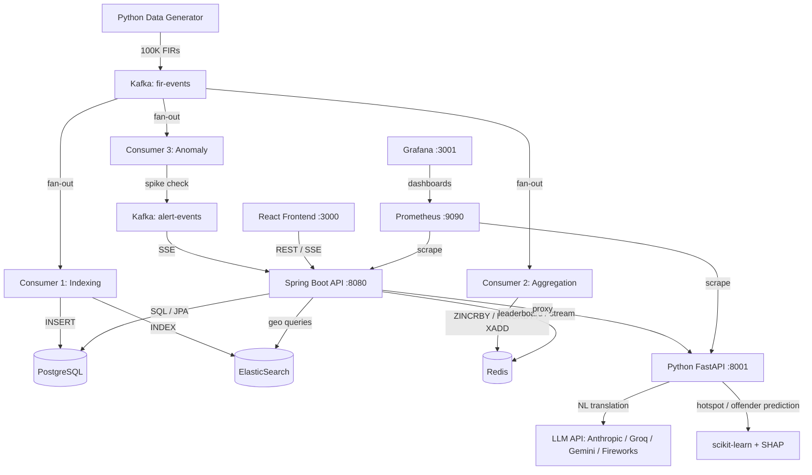

# KSP Intelligence Portal


> A production-grade distributed intelligence platform transforming Karnataka's crime data into real-time, explainable, geospatial insights.

---

## Hackathon Context

| Field | Value |
|-------|-------|
| **Event** | KSP Datathon 2026 |
| **Organizer** | Karnataka State Police + Hack2Skill |
| **Challenge** | Challenge 2 — AI-Driven Crime Analytics & Visualization Platform |
| **Team** | HotspotHunters |
| **Engineer** | Archishman Das (Solo) |
| **Status** | Prototype Submission |

---

## The Problem We're Solving

Karnataka State Police operates **1,100+ police stations** across 30 districts, each generating First Information Reports (FIRs) daily. Today, this data is:

- **Fragmented** — stored in isolated station-level systems with no central query layer
- **Slow to analyze** — a superintendent asking "which districts saw a spike in robberies last week?" must call each station manually
- **Geospatially blind** — no live map or heatmap exists to visualise *where* crimes cluster
- **Not predictive** — there is no system to forecast *where* crime is likely to surge next
- **Not auditable** — officer queries on sensitive criminal data are not logged for accountability

**Success looks like this:** An officer opens a single dashboard, sees a live crime heatmap of the entire state, types *"robberies near Yelahanka last 30 days"* in plain English, sees results on a map within seconds, gets a 7-day risk forecast for every taluk, and every action is audit-logged for accountability — all backed by real data, never fabricated by an LLM.

---

## Solution Overview

The KSP Intelligence Portal is a polyglot microservices platform that ingests FIR events via Kafka, persists them to PostgreSQL and ElasticSearch, maintains a sub-millisecond live crime leaderboard in Redis, predicts future hotspots with scikit-learn, and translates natural-language queries into ElasticSearch geo-queries via a provider-chain LLM layer.

**Who uses it:**

- **ANALYST** — front-line officer: searches, views hotspots, runs NL queries, sees predictions. District-scoped.
- **SUPERVISOR** — manages alerts, views offender networks, broader district scope.
- **ADMIN** — state-wide access, audit log retrieval, full RBAC.

**Key capabilities:**

1. **Real-time hotspot leaderboard** — Redis Sorted Set (`ZINCRBY`) ranks districts by live crime count; updates every 2-5 seconds via Kafka.
2. **Geospatial search** — ElasticSearch `geo_point` + `geo_distance` queries return results in <150 ms across 200K records.
3. **Predictive risk scoring** — Random Forest hotspot prediction (7-day taluk risk) + Gradient Boosting offender recidivism with SHAP explanations.
4. **Natural language query** — officer types or speaks a query; a configurable LLM provider chain (Anthropic → Groq → Gemini → Fireworks → local regex) translates it to structured ES parameters — never as raw ES DSL.
5. **Offender network graph** — co-crime graph traversal from PostgreSQL `offender_network` table.
6. **Live alert stream** — Redis Stream → SSE pushes new incidents to the browser in real time.
7. **Audit trail** — every API call is interceptor-logged to an append-only PostgreSQL `audit_log` table with officer ID, endpoint, IP, and result count.

---

## Architecture Overview



---

## Key Technical Highlights

- **Kafka fan-out pattern** — three independent consumer groups (`indexing-service`, `aggregation-service`, `anomaly-service`) consume the same `fir-events` topic in parallel, each with its own offset — no blocking, no coupling.
- **Redis Sorted Set leaderboard** — `ZINCRBY hotspots:live 1 <district>` is O(log N); `ZREVRANGE` top-10 is O(K). Same pattern as Netflix's trending row. Sub-millisecond reads.
- **ElasticSearch geo_point** — 200K documents indexed with `geo_point` mapping; `geo_distance` and `geo_bounding_box` queries return in <150 ms; full-text on `modus_operandi` with English analyser.
- **LLM as translator, not oracle** — the LLM *never* generates data. It only returns structured JSON (`crime_type`, `location`, `radius_km`, `days_back`). Spring Boot builds the actual ES query. This eliminates hallucination risk in a law-enforcement context.
- **SHAP explainability** — offender recidivism scores are accompanied by `shap_reasons[]` (e.g., `prior_offenses`, `age_group`) so every prediction is auditable.
- **PostgreSQL monthly partitioning** — `fir_records` is `PARTITION BY RANGE (incident_ts)`; each month gets its own partition, keeping time-series queries fast.
- **Append-only audit trail** — `audit_log` has no UPDATE/DELETE permissions; every officer query is recorded with IP, endpoint, and result count.

---

## Quick Start

```bash
# Prerequisites: Docker Desktop (8 GB RAM), Git
git clone https://github.com/starving-array/HotspotHunters-ai.git
cd HotspotHunters-ai
cp .env.example .env
# Edit .env: add ANTHROPIC_API_KEY or GROQ_API_KEY if you want LLM (optional — regex fallback works)
docker compose up -d
# Wait ~60 seconds for all services to initialize
docker compose ps    # all should show "healthy"
```

Open:

| URL | Purpose |
|-----|---------|
| http://localhost:3000 | React dashboard (login: `officer1` / `password1`) |
| http://localhost:8080/swagger-ui.html | Swagger API docs |
| http://localhost:8080/actuator/health | Health check |
| http://localhost:8080/actuator/prometheus | Prometheus metrics |
| http://localhost:8001/docs | FastAPI ML service docs |
| http://localhost:9090 | Prometheus UI |
| http://localhost:3001 | Grafana (admin / admin) |

---

## API Documentation

### Authentication
All endpoints except `/auth/login` require:
```
Authorization: Bearer <JWT_TOKEN>
```

### Endpoints

| Method | Path | Role | Description |
|--------|------|------|-------------|
| POST | `/api/v1/auth/login` | Public | Login with username/password, returns JWT |
| GET | `/api/v1/hotspots?limit=N` | ANALYST+ | Top N districts from Redis Sorted Set (default 10, max 100) |
| GET | `/api/v1/search?q=&lat=&lon=&radiusKm=` | ANALYST+ | Keyword + optional geo-distance search on ElasticSearch (max 20 results) |
| GET | `/api/v1/trends/{districtCode}?months=M` | ANALYST+ | Monthly incident counts per district from PostgreSQL |
| GET | `/api/v1/alerts/stream` | ANALYST+ | Server-Sent Events live alert feed from Redis Stream |
| POST | `/api/v1/nl/query` | ANALYST+ | Natural-language query → LLM translation → structured ES params |
| POST | `/api/v1/predict/hotspot` | ANALYST+ | 7-day taluk risk prediction (Random Forest) |
| POST | `/api/v1/predict/offender` | ANALYST+ | Offender recidivism risk score (Gradient Boosting + SHAP) |
| POST | `/api/v1/audit` | SUPERVISOR+ | Manually append an audit-log entry |
| GET | `/api/v1/audit/{id}` | ADMIN | Retrieve a specific audit-log entry by UUID |

---

## Environment Variables

| Variable | Required | Default | Description |
|----------|----------|---------|-------------|
| `POSTGRES_DB` | Yes | `ksp_intelligence` | Database name |
| `POSTGRES_USER` | Yes | `ksp_app` | DB user (least privilege) |
| `POSTGRES_PASSWORD` | Yes | `changeme` | DB password — **never commit** |
| `POSTGRES_HOST` | Yes | `postgres` | DB host (`localhost` for non-Docker) |
| `KAFKA_BOOTSTRAP_SERVERS` | Yes | `kafka:29092` | Kafka broker address |
| `KAFKA_FIR_TOPIC` | Yes | `fir-events` | Kafka topic for FIR events |
| `KAFKA_ALERT_TOPIC` | Yes | `alert-events` | Kafka topic for anomaly alerts |
| `ELASTICSEARCH_HOST` | Yes | `elasticsearch` | ES host |
| `ELASTICSEARCH_PORT` | Yes | `9200` | ES port |
| `ELASTICSEARCH_INDEX` | Yes | `crime-index` | ES index name for FIR records |
| `REDIS_HOST` | Yes | `redis` | Redis host |
| `REDIS_PORT` | Yes | `6379` | Redis port |
| `JWT_SECRET` | **Critical** | `changeme123` | JWT signing secret — use `openssl rand -hex 32` |
| `ML_SERVICE_URL` | Yes | `http://localhost:8001` | FastAPI ML service base URL |
| `ANTHROPIC_API_KEY` | No | — | Anthropic API key (for NL translation) |
| `GROQ_API_KEY` | No | — | Groq API key (alternative LLM) |
| `GEMINI_API_KEY` | No | — | Gemini API key (alternative LLM) |
| `LLM_PROVIDERS` | No | — | Comma-separated provider list, e.g. `anthropic,groq,local` |
| `RATE_LIMIT_LIMIT_PER_MINUTE` | No | `60` | Default rate limit per officer |

---

## Project Structure

```
HotspotHunters-ai/
├── api/                          # Spring Boot API gateway (Java 21, Maven)
│   ├── src/main/java/com/ksp/intelligence/
│   │   ├── config/               # Redis, Kafka, ES, Security, Jackson config
│   │   ├── controller/           # REST controllers (hotspots, search, trends, alerts, predictions, NL, audit)
│   │   ├── consumer/             # Kafka consumers (indexing, aggregation, anomaly)
│   │   ├── service/              # Business logic (anomaly detection, alert publishing)
│   │   ├── repository/           # JPA repositories (FirRecord, Offender, AuditLog)
│   │   ├── model/                # JPA entities + DTOs (FirRecord, Offender, Victim, AlertEvent, AuditLog)
│   │   └── filter/               # JWT filter, rate-limit filter
│   ├── src/main/resources/
│   │   └── application.yml       # Spring Boot config (Kafka, ES, Redis, JPA, Actuator)
│   └── pom.xml                   # Maven deps (Spring Boot, Kafka, ES, Redis, JPA, Security, JJWT)
├── ml-service/                   # Python FastAPI ML + LLM service
│   ├── app.py                    # FastAPI app (prediction + NL translation endpoints)
│   ├── requirements.txt          # FastAPI, uvicorn, pydantic, httpx, prometheus
│   └── test_app.py               # Pytest tests for all ML endpoints
├── data-generator/               # Python synthetic FIR generator + Kafka producer
│   ├── generate.py               # Generates 100K synthetic FIR records
│   ├── kafka_producer.py         # Streams live FIR events to Kafka
│   └── requirements.txt
├── frontend/                     # React + Vite + TypeScript dashboard
│   ├── src/
│   │   ├── App.tsx               # Main layout (sidebar + map)
│   │   ├── components/            # SearchBar, NLQueryBar, MapView, HotspotLeaderboard, LiveAlerts, PredictionPanel
│   │   └── index.css             # Dark theme
│   ├── vite.config.ts            # Vite + proxy to Spring Boot :8080
│   └── package.json
├── infra/                        # Docker Compose + infrastructure config
│   ├── docker-compose.yml        # Full stack (9 services + Prometheus + Grafana)
│   ├── postgres/init.sql         # Schema: fir_records (partitioned), offenders, victims, offender_network, audit_log
│   ├── elasticsearch/mappings.json  # ES index mapping with geo_point
│   └── kafka/topics.sh           # Kafka topic creation script
├── docs/                         # Architecture docs + developer guide
│   ├── ARCHITECTURE.md           # Detailed technical architecture (C4 diagrams, ADRs)
│   └── DEVELOPER_GUIDE.md        # Step-by-step developer setup guide
├── .env.example                  # Placeholder env vars (committed)
├── .gitignore
├── CHANGELOG.md
└── README.md                     # This file
```

---

## Development Setup (Local Without Docker)

### Spring Boot API
```bash
cd api
mvn spring-boot:run    # runs on :8080
```

### Python ML Service
```bash
cd ml-service
pip install -r requirements.txt
uvicorn app:app --reload --port 8001
```

### React Frontend
```bash
cd frontend
npm install
npm run dev    # runs on :3000, proxies /api to :8080
```

### Infrastructure Only (via Docker)
```bash
docker compose up postgres redis elasticsearch kafka zookeeper -d
```

---

## Running Tests

```bash
# Java unit + integration tests
cd api && mvn test

# Python ML service tests
cd ml-service && pytest test_app.py -v

# Run all tests + verify
cd api && mvn verify
```

---

## Design Decisions & Trade-offs

### Why ElasticSearch over PostGIS for geospatial queries
ElasticSearch's `geo_point` type with `geo_distance` and `geo_bounding_box` queries is purpose-built for sub-second spatial search at scale. PostGIS is excellent for complex GIS operations (polygon intersection, routing), but for a heatmap + radius-search use case, ElasticSearch's inverted-index-based geo queries are faster and integrate natively with full-text search on `modus_operandi` text fields.

### Why Redis Sorted Set over a database query for the live leaderboard
`ZINCRBY` is O(log N) per increment; `ZREVRANGE 0 9` for top-10 is O(K). A SQL `GROUP BY district ORDER BY count DESC LIMIT 10` would require a full scan or a materialised view refreshed on a schedule. The Sorted Set is updated atomically on every Kafka event and is always current — no batching, no polling.

### Why scikit-learn over deep learning for predictions
The dataset is structured tabular data (district, day-of-week, prior counts). Random Forest and Gradient Boosting excel on tabular features, train in seconds, produce interpretable feature importances (and SHAP values), and deploy as a single `.pkl` file with no GPU requirement. Deep learning would add complexity without accuracy gains on this data shape.

### Why LLM-as-translator vs RAG (and why RAG was rejected)
RAG (Retrieval-Augmented Generation) lets the LLM *generate answers from retrieved documents* — but in a law-enforcement context, an LLM summarising crime records could hallucinate, omit, or fabricate. Instead, the LLM only translates a natural sentence into structured parameters (`crime_type`, `location`, `radius_km`, `days_back`). Spring Boot then builds and executes the ElasticSearch query. The LLM never touches the data. This is the same pattern used by Elastic's Kibana AI Assistant and Snowflake Cortex.

---

## Observability

| Service | URL | Credentials |
|---------|-----|-------------|
| **Prometheus** | http://localhost:9090 | — |
| **Grafana** | http://localhost:3001 | admin / admin |
| **API metrics** | http://localhost:8080/actuator/prometheus | — |
| **ML metrics** | http://localhost:8001/metrics | — |

The Grafana dashboard shows: API request latency histogram, error rate (5xx), Redis key-space size, Kafka consumer lag, and ML-service request duration.

---

## Roadmap (Post-Hackathon)

| Phase | Goal |
|-------|------|
| Phase 2 | Semantic modus operandi clustering (pgvector + sentence embeddings) |
| Phase 3 | Kannada language support (IndicNLP + multilingual LLM) |
| Phase 4 | Real-time video feed integration (CCTV anomaly detection) |
| Phase 5 | Mobile officer app (React Native + push notifications) |

---

## Documentation

- [Architecture (C4 diagrams, ADRs, data flows)](docs/ARCHITECTURE.md) — detailed technical reference
- [Developer Guide (setup, workflow, troubleshooting)](docs/DEVELOPER_GUIDE.md) — step-by-step for developers
- Full architecture plan: `KSP_Datathon_2026_Architecture_And_Dev_Plan.md`

---

## License

Proprietary — All Rights Reserved. See [LICENSE](LICENSE) for details. No part of this software may be used, copied, or distributed without the express written permission of the copyright holder.

---

## Author

**Archishman Das** — Senior Backend Engineer  
GitHub: [starving-array](https://github.com/starving-array)  
Email: gowork.archis@gmail.com
