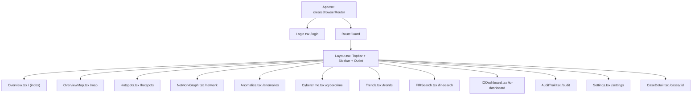
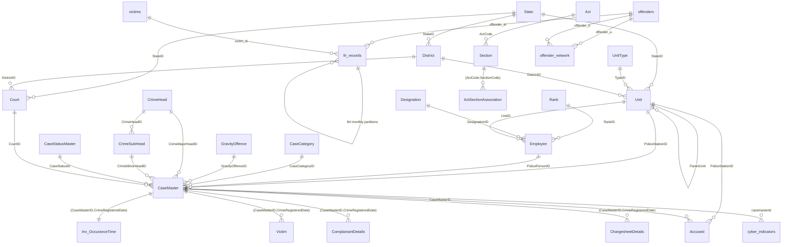
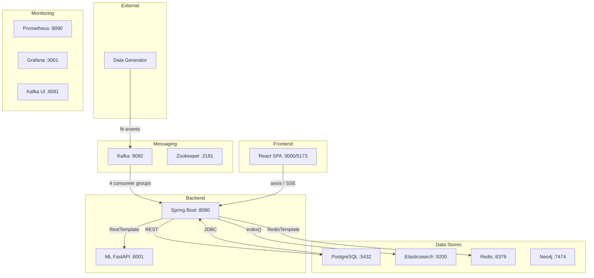
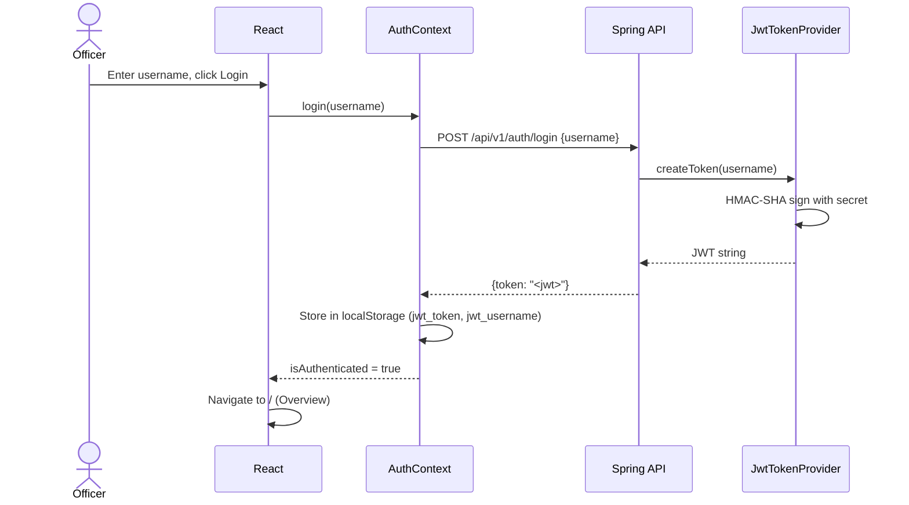
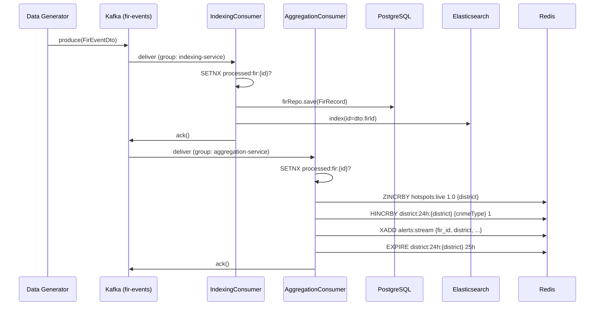
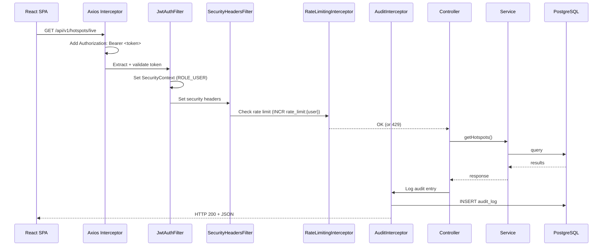
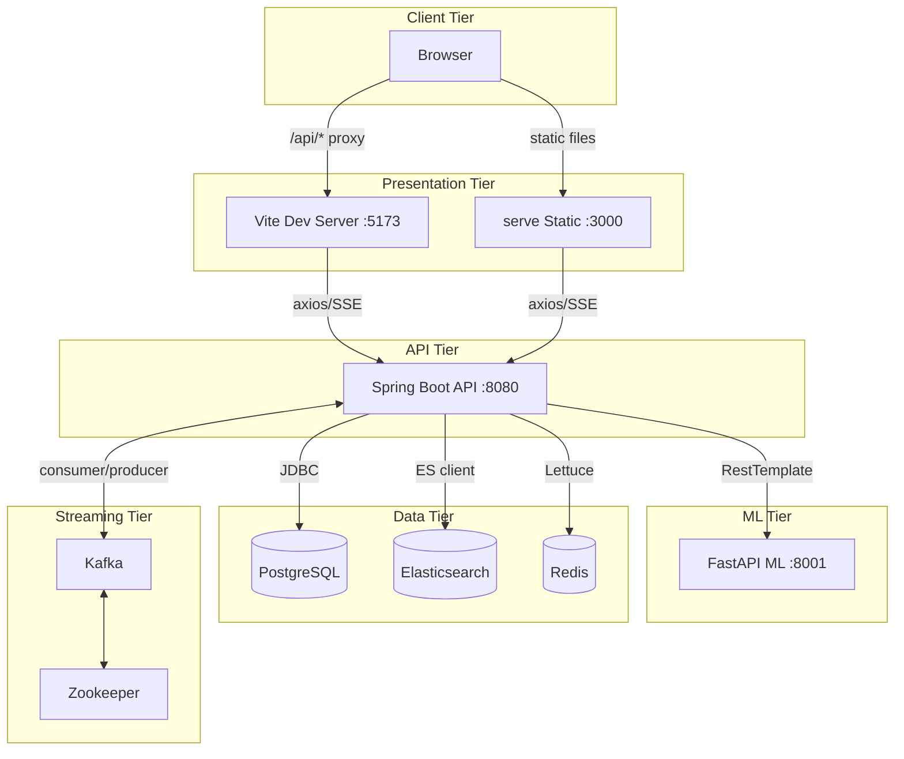
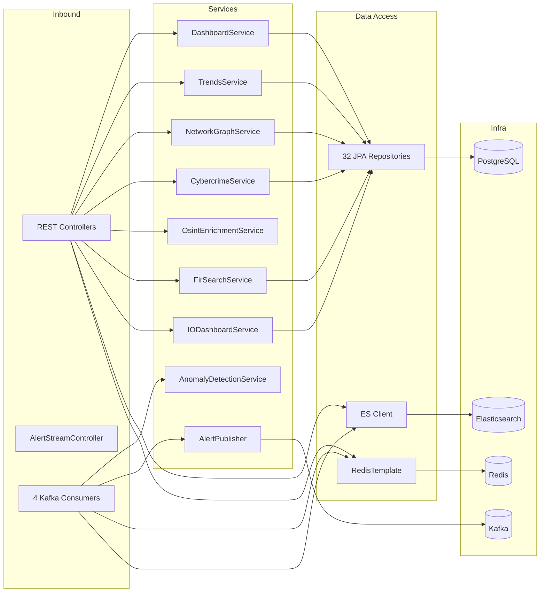
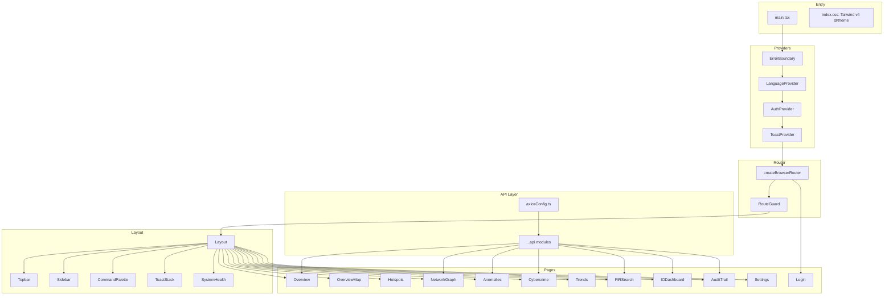

# KSP Intelligence Portal — Developer Handbook

**Project:** KSP Datathon 2026 (Challenge 2) — Karnataka State Police Crime Intelligence Platform
**Repository:** `E:\project\HotspotHunters-ai`
**Audit Date:** July 2026

---

## Table of Contents

1. [Repository Discovery & Structure](#1-repository-discovery--structure)
2. [Technology Stack](#2-technology-stack)
3. [Architecture Overview](#3-architecture-overview)
4. [Applications Inventory](#4-applications-inventory)
5. [Backend Deep Dive — Spring Boot API](#5-backend-deep-dive--spring-boot-api)
6. [Frontend Deep Dive — React SPA](#6-frontend-deep-dive--react-spa)
7. [Database Schema](#7-database-schema)
8. [Complete API Inventory](#8-complete-api-inventory)
9. [Authentication & Security](#9-authentication--security)
10. [Communication Patterns](#10-communication-patterns)
11. [Runtime Ports](#11-runtime-ports)
12. [Configuration Reference](#12-configuration-reference)
13. [Build & Deployment](#13-build--deployment)
14. [Dependency Graph](#14-dependency-graph)
15. [Sequence Diagrams](#15-sequence-diagrams)
16. [Architecture Diagrams](#16-architecture-diagrams)
17. [Code Quality Review](#17-code-quality-review)
18. [Improvement Recommendations](#18-improvement-recommendations)

---

## 1. Repository Discovery & Structure

### Top-Level Directory Map

```
E:\project\HotspotHunters-ai/
├── api/                          # Spring Boot REST API + Kafka consumers (Java 17)
├── frontend/                     # React SPA dashboard (TypeScript, Vite)
├── ml-service/                   # FastAPI ML inference service (Python)
├── data-generator/               # Synthetic FIR data generator (Python)
├── infra/                        # Docker Compose, SQL, ES mappings, Prometheus
│   ├── docker-compose.yml        # Main compose (11 services)
│   ├── docker-compose.dev.yml    # Dev override (adds Kibana)
│   ├── postgres/
│   │   ├── init.sql              # Full schema (750 lines, idempotent)
│   │   └── migrations/           # 7 incremental SQL migration files
│   ├── elasticsearch/
│   │   └── mappings.json         # crime-index mapping
│   ├── kafka/
│   │   └── topics.sh             # Topic creation script
│   ├── neo4j/
│   │   └── schema.cypher         # Neo4j constraints
│   └── prometheus/
│       └── prometheus.yml        # Scrape config
├── UI_ksp_intelligence_portal/   # DESIGN MOCKUPS (not runnable)
├── scripts/                      # Operational Python scripts (seeding, verification)
├── docs/                         # ARCHITECTURE.md, DEVELOPER_GUIDE.md
├── .github/workflows/ci.yml     # GitHub Actions CI
├── ksp_audit.py                  # Post-deployment audit script
├── .env.example                  # Environment variable template
├── catalyst.json                 # Catalyst deployment config
└── *.md                          # Planning/audit documents (30+ files)
```

### Key Finding: Only One Frontend

There is **exactly one runnable frontend** in `frontend/`. The `UI_ksp_intelligence_portal/` directory is a **non-runnable design mockup library** — static HTML + screenshot pairs + 4 loose `.jsx` snippet prototypes. It is NOT a second frontend.

The two ports the user references map to the **same codebase**:

| Port | Mode | Description |
|------|------|-------------|
| 5173 | Dev server | `npm run dev` → Vite default port (proxies `/api` → `:8080`) |
| 3000 | Production container | `frontend/Dockerfile` serves `dist/` via `npx serve -l 3000` |

### Applications Found

| # | App | Path | Type | Stack | Port | One-line Purpose |
|---|-----|------|------|-------|------|------------------|
| 1 | Spring Boot API | `api/` | Backend | Java 17, Spring Boot 3.4.13, JPA, Kafka, Redis, ES, JWT | 8080 | Primary REST API, Kafka consumers, SSE alerts, proxies ML |
| 2 | React Frontend | `frontend/` | SPA | React 18, TypeScript 5.5, Vite 5.3, Tailwind v4 | 5173/3000 | Officer dashboard: maps, hotspots, search, anomalies, cybercrime |
| 3 | FastAPI ML | `ml-service/` | Inference | Python 3.11, FastAPI, scikit-learn, SHAP, Anthropic | 8001 | ML predictions (hotspot risk, offender recidivism, FIR similarity, NL→ES) |
| 4 | Data Generator | `data-generator/` | Tooling | Python 3.11, psycopg2, faker, kafka-python | — | Generates 100K synthetic FIRs, bulk-loads PG+ES, streams to Kafka |
| 5 | UI Mockups | `UI_ksp_intelligence_portal/` | **NOT RUNNABLE** | Static HTML + Tailwind CDN + 4 JSX snippets | — | Design reference only |

---

## 2. Technology Stack

### Backend (api/)

| Category | Technology | Version |
|----------|-----------|---------|
| Language | Java | 17 |
| Framework | Spring Boot | 3.4.13 |
| Build | Maven | (wrapper not present) |
| ORM | Hibernate / Spring Data JPA | via Boot |
| Database | PostgreSQL | 16 |
| Cache | Redis (Lettuce) | 7-alpine |
| Search | Elasticsearch | 8.14.0 |
| Messaging | Apache Kafka | 7.6.1 |
| Security | JJWT (io.jsonwebtoken) | 0.12.5 |
| API Docs | Springdoc OpenAPI | 2.8.5 |
| Monitoring | Micrometer + Prometheus | via Boot |
| Testing | JUnit 5, Mockito, Testcontainers, H2 | via Boot |

### Frontend (frontend/)

| Category | Technology | Version |
|----------|-----------|---------|
| Language | TypeScript | 5.5.2 (strict) |
| Framework | React | 18.3.1 |
| Build | Vite | 5.3.1 |
| Styling | Tailwind CSS | 4.3.3 (`@tailwindcss/vite`) |
| Routing | react-router-dom | 7.18.1 |
| HTTP | axios | 1.7.2 |
| Map | Leaflet + react-leaflet | 1.9.4 / 4.2.1 |
| Charts | Recharts | 3.10.0 |
| Graph | react-force-graph-2d | 1.29.1 |
| Animation | framer-motion | 12.42.2 |
| Icons | lucide-react | 1.25.0 |
| Virtualization | @tanstack/react-virtual | 3.14.8 |
| Fonts | @fontsource/inter, @fontsource/jetbrains-mono | self-hosted |
| Testing | Vitest + Testing Library + jsdom | 2.x |
| State | React Context (3 providers) | — |

### ML Service (ml-service/)

| Category | Technology | Version |
|----------|-----------|---------|
| Language | Python | 3.11 |
| Framework | FastAPI + uvicorn | 0.30.1 |
| ML | scikit-learn, SHAP, pandas, numpy, joblib | scikit 1.5, SHAP 0.45 |
| LLM | anthropic (Claude client) | latest |
| HTTP | httpx | latest |
| Monitoring | prometheus-client | latest |

### Infrastructure

| Service | Image | Version |
|---------|-------|---------|
| PostgreSQL | postgres | 16 |
| Redis | redis | 7-alpine |
| Elasticsearch | elastic/elasticsearch | 8.14.0 |
| Kafka | confluentinc/cp-kafka | 7.6.1 |
| Zookeeper | confluentinc/cp-zookeeper | 7.6.1 |
| Neo4j | neo4j | 5.20.0 |
| Prometheus | prom/prometheus | v2.53.0 |
| Grafana | grafana/grafana | 11.1.0 |
| Kafka UI | provectuslabs/kafka-ui | latest |
| Kibana | elastic/kibana (dev only) | 8.14.0 |

---

## 3. Architecture Overview

### Pattern: Event-Driven Microservices (Hybrid)

```
┌─────────────┐     ┌──────────────┐     ┌─────────────┐
│  Data Gen   │────>│    Kafka     │────>│ Spring Boot │
│  (External) │     │  fir-events  │     │   API (4   │
└─────────────┘     │              │     │ consumers)  │
                    │ alert-events │     │             │
                    └──────────────┘     │ REST:8080   │
                                         │             │
┌─────────────┐     ┌──────────────┐     │ SSE Alerts  │
│  ML Service │<────│  WebClient / │     │ Redis Cache │
│  FastAPI    │────>│  RestTemplate│     │ PG + ES     │
│  :8001      │     └──────────────┘     └──────┬──────┘
└─────────────┘                                 │
                                                v
                                        ┌──────────────┐
                                        │   React SPA  │
                                        │  :3000/5173  │
                                        └──────────────┘
```

- **Event-Driven:** Kafka `fir-events` topic fans out to 4 consumer groups (indexing, aggregation, anomaly, enricher) — each independently processes the same event.
- **REST API:** Spring Boot exposes 22 REST endpoints consumed by the React SPA.
- **SSE Push:** Live alerts streamed from Redis Stream → SseEmitter on `/api/v1/alerts/stream`.
- **Polyglot ML:** Spring Boot proxies to Python FastAPI for predictions (hotspot risk, offender SHAP, FIR similarity, NL→ES).
- **Data Stores:** PostgreSQL (canonical), Elasticsearch (search index), Redis (hotspots leaderboard, anomaly rollups, alert stream, OSINT cache, rate limiting, idempotency).

### Why This Architecture

1. **Kafka fan-out** allows independent scaling of indexing (dual-write PG+ES), aggregation (Redis leaderboard), anomaly detection (Poisson z-score), and cyber enrichment (stub) — each with its own consumer group offset.
2. **Redis as real-time layer** provides sub-millisecond hotspot leaderboard reads, TTL-based anomaly windows, and pub/sub-style alert streaming without a dedicated message broker for SSE.
3. **ML service isolation** lets models be updated, trained, or scaled independently without touching the Java API layer.
4. **No scheduled jobs** — everything is event-driven (Kafka consumers) or request-driven (REST).

---

## 4. Applications Inventory

### 4.1 Spring Boot API (`api/`)

- **Purpose:** Primary backend — REST endpoints, Kafka consumers, SSE alert streaming, ML proxy
- **Build:** `docker compose build spring-boot-api` (multi-stage Dockerfile: Maven build → `temurin:17-jre-alpine` runtime)
- **Startup:** `java -jar ksp-intelligence-0.2.0-SNAPSHOT.jar` (default port 8080)
- **Key Dependencies:** spring-boot-starter-web, -data-jpa, -data-redis, -data-elasticsearch, spring-kafka, -webflux, -security, -actuator, -validation, springdoc-openapi, jjwt, micrometer-registry-prometheus, lombok
- **Tests:** 23 test methods (12 unit + 2 integration + 1 context-load + 1 repository slice)

### 4.2 React Frontend (`frontend/`)

- **Purpose:** Single-page officer intelligence dashboard — 12 pages, 15 components, 3 contexts
- **Build:** `npm run build` → `dist/`
- **Dev:** `npm run dev` → Vite at :5173
- **Prod:** Dockerfile → `npx serve -s dist -l 3000`
- **Key Pages:** Overview, OverviewMap, Hotspots, NetworkGraph, Anomalies, Cybercrime, Trends, FIRSearch, IODashboard, AuditTrail, Settings, Login

### 4.3 ML Service (`ml-service/`)

- **Purpose:** ML inference — hotspot risk (Random Forest), offender recidivism + SHAP (Gradient Boosting), FIR similarity (TF-IDF), NL→ES query translation
- **Endpoints:** `/predict/hotspot`, `/predict/offender`, `/similarity/{firId}`, `/nl/translate`, `/health`
- **Models (trained):** `ml-service/models/hotspot_rf_v1.pkl`, `offender_gb_v1.pkl`
- **Cruft:** `ml-service/app_old.py` — legacy single-file version (dead code, not wired to Dockerfile)

### 4.4 Data Generator (`data-generator/`)

- **Purpose:** Generate 100K synthetic FIRs, 15K offenders (SHA-256 hashed, no PII), 80K victims, 5K co-crime edges
- **Usage:** Standalone tool, connect to running PG + ES + Kafka
- **Output:** PostgreSQL bulk-load + Elasticsearch bulk-index + Kafka stream (~1 event/3s)

### 4.5 UI Design Mockups (`UI_ksp_intelligence_portal/`)

- **NOT an application** — static design artifacts (13 screen mockups, 4 JSX snippet prototypes, DESIGN.md)
- **Every screen** has a 1:1 ported page in `frontend/src/pages/`

---

## 5. Backend Deep Dive — Spring Boot API

### 5.1 Package Structure

```
com.ksp.intelligence
├── KspIntelligenceApplication.java       # @SpringBootApplication
├── config/                                # 9 @Configuration classes
│   ├── SecurityConfig.java                # CORS, filter chain, interceptors
│   ├── RedisConfig.java                   # StringRedisTemplate beans
│   ├── RedisKeysProperties.java           # Type-safe Redis key config
│   ├── KafkaConsumerConfig.java           # @EnableKafka, container factory
│   ├── ElasticSearchConfig.java           # ES client with timeouts
│   ├── PostgresConfig.java                # @EnableJpaRepositories
│   ├── RestClientConfig.java              # WebClient beans (unused)
│   ├── JacksonConfig.java                 # ObjectMapper (snake_case, JavaTimeModule)
│   └── AnomalyProperties.java             # Anomaly detection config
├── controller/                            # 18 @RestController + GlobalExceptionHandler
│   ├── AuthController.java                # POST /api/v1/auth/login
│   ├── HotspotController.java             # GET /api/v1/hotspots/live, /hotspots/breakdown
│   ├── SearchController.java              # GET /api/v1/search, /search/geo, /search/fulltext
│   ├── TrendController.java               # GET /api/v1/trends/{code}, /trends/overview, /trends/compare
│   ├── AuditController.java               # CRUD /api/v1/audit
│   ├── AlertStreamController.java         # GET /api/v1/alerts/stream (SSE)
│   ├── AlertHistoryController.java        # GET /api/v1/alerts
│   ├── AnomalyController.java             # GET /api/v1/anomalies
│   ├── CaseDetailController.java          # GET /api/v1/cases/{caseMasterId}
│   ├── CybercrimeController.java          # GET /api/v1/cyber/*, /api/v1/osint/*
│   ├── DashboardController.java           # GET /api/v1/dashboard/kpis
│   ├── FirSearchController.java           # GET /api/v1/fir-search
│   ├── IODashboardController.java         # GET /api/v1/io/dashboard
│   ├── NetworkController.java             # GET /api/v1/network/*
│   ├── NLQueryController.java             # POST /api/v1/nl/query
│   ├── PredictionController.java          # POST /api/v1/predict/*
│   ├── SystemHealthController.java        # GET /api/v1/system/health
│   └── GlobalExceptionHandler.java        # @ControllerAdvice (400 handling)
├── consumer/                              # 4 Kafka @KafkaListener
│   ├── IndexingConsumer.java              # PG + ES dual-write
│   ├── AggregationConsumer.java           # Redis hotspot/alert update
│   ├── AnomalyConsumer.java               # Poisson z-score detection
│   └── CybercrimeEnricherConsumer.java    # Stub (logs + acks)
├── service/                               # 10 @Service
│   ├── AlertPublisher.java                # KafkaTemplate<AlertEvent> producer
│   ├── AnomalyDetectionService.java       # Rolling-window z-score
│   ├── CaseDetailService.java             # Case detail query + Redis cache + timeline
│   ├── CybercrimeService.java             # Cyber dashboard aggregation
│   ├── DashboardService.java              # KPI queries
│   ├── FirSearchService.java              # ILIKE search
│   ├── IODashboardService.java            # IO leaderboard
│   ├── NetworkGraphService.java           # Network graph + SHAP
│   ├── OsintEnrichmentService.java        # OSINT cache + enrichment
│   └── TrendsService.java                 # Forecast, heatmap, movers
├── repository/                            # 32 Spring Data JPA interfaces
├── model/                                 # 33 @Entity + 2 Kafka POJOs + 7 enums
├── dto/                                   # 28 response DTOs
├── security/                              # JWT filter, provider, headers
├── interceptor/                           # RateLimitingInterceptor, AuditInterceptor
└── converter/                             # 5 JPA AttributeConverters
```

### 5.2 Kafka Consumer Details

All 4 consumers read from `fir-events` topic (30 partitions, 7-day retention):

| Consumer | Group ID | Concurrency | Key Behavior |
|----------|----------|-------------|--------------|
| IndexingConsumer | `indexing-service` | 3 threads | Dual-write `FirRecord` to PG (`firRepo.save`) + ES (`_id=firId`). Idempotent via PK. On failure: throw RuntimeException, no ack. |
| AggregationConsumer | `aggregation-service` | 3 threads | SETNX idempotency (`processed:fir:{firId}`, TTL 1h). ZINCRBY `hotspots:live`, HINCRBY `district:24h:{district}`, XADD `alerts:stream`. |
| AnomalyConsumer | `anomaly-service` | 3 threads | SETNX idempotency. Calls `AnomalyDetectionService.observeAndDetect()` for Poisson z-score. Publishes AlertEvent to `alert-events` topic if z≥2. |
| CybercrimeEnricherConsumer | `enricher-service` | 1 thread | **Stub** — logs at DEBUG, always acks. |

### 5.3 Redis Usage (9 patterns)

| Pattern | Keys | Used By |
|---------|------|---------|
| Sorted Set (ZSET) | `hotspots:live` | AggregationConsumer (ZINCRBY), HotspotController (ZREVRANGE) |
| Sorted Set (ZSET) | `district:rollup:60:{district}` | AnomalyDetectionService (ZADD, ZCARD, ZREMRANGEBYSCORE) |
| Hash (HASH) | `district:24h:{district}` | AggregationConsumer (HINCRBY + EXPIRE) |
| Hash (HASH) | `district:names` | HotspotController (HGET) |
| Stream | `alerts:stream` | AggregationConsumer (XADD), AlertStreamController (XREAD SSE), AlertHistoryController, AnomalyController |
| String (SETNX) | `processed:fir:{firId}` | AggregationConsumer, AnomalyConsumer (1h TTL idempotency) |
| String (INCR) | `district:baseline:24h:{district}` | AnomalyDetectionService |
| String (INCR) | `rate_limit:{user}` | RateLimitingInterceptor (1-min TTL, 100 req/min limit) |
| String (GET/SET) | `osint:cache:{type}:{value}` | OsintEnrichmentService (read-through cache) |
| Sorted Set (ZSET) | `link_prediction:{accusedId}` | NetworkController (read-only, written by ML service) |

### 5.4 External API Calls (ML Service)

| Caller | Method | ML Endpoint | HTTP Client |
|--------|--------|-------------|-------------|
| PredictionController | POST | `/predict/hotspot` | `new RestTemplate()` |
| PredictionController | POST | `/predict/offender` | `new RestTemplate()` |
| NLQueryController | POST | `/nl/translate` | `new RestTemplate()` |
| NetworkController | GET | `/similarity/{firId}?top_k=` | `new RestTemplate()` |
| NetworkGraphService | POST | `/predict/offender` | `new RestTemplate()` |

**Note:** `RestClientConfig` defines properly-configured WebClient beans with Netty timeouts, but **no controller injects them** — all use synchronous `new RestTemplate()`.

### 5.5 ML Service Default URL Inconsistency

| Source | Default |
|--------|---------|
| `application.yml` | `http://ml-service:8001` |
| `PredictionController` @Value | `http://localhost:8001` |
| `NetworkController` @Value | `http://ml-service:8001` |
| `RestClientConfig` @Value | `http://python-ml:8001` |

Production **must** set `ML_SERVICE_URL` env var for consistency.

---

## 6. Frontend Deep Dive — React SPA

### 6.1 Routing



### 6.2 Component Architecture

```
Provider Tree (outer→inner):
  ErrorBoundary → LanguageProvider → AuthProvider → ToastProvider → Suspense → Router

Layout Shell:
  Layout.tsx
    ├── Topbar.tsx (hamburger, brand, command palette trigger, clock, language toggle)
    ├── Sidebar.tsx (9 nav links + settings + system health toggle)
    ├── SystemHealth.tsx (drawer)
    ├── CommandPalette.tsx (⌘K modal)
    ├── ToastStack.tsx (top-right notifications)
    └── <Outlet/> (page content)

RouteGuard.tsx: redirects to /login if !isAuthenticated
```

### 6.3 State Management

| Context | File | Exposes |
|---------|------|---------|
| AuthContext | `context/AuthContext.tsx` | `{ token, username, login(username), logout, isAuthenticated }` |
| LanguageContext | `context/LanguageContext.tsx` | `{ locale, t(key), setLocale, toggleLocale }` — 110 keys in en/kn |
| ToastContext | `context/ToastContext.tsx` | `{ toasts[], pushToast({type,title,message}), dismissToast(id) }` — cap 5, auto-dismiss 5s |

### 6.4 API Layer

**Config:** `src/api/axiosConfig.ts`
- Base URL: `VITE_API_URL || 'http://localhost:8080'`
- Request interceptor: adds `Authorization: Bearer <jwt_token>` from localStorage
- Response interceptor: on 401/403 → clears localStorage, reloads page

**Modules (12):** cases.ts, dashboard.ts, hotspots.ts, alerts.ts, anomalies.ts, auditTrail.ts, cybercrime.ts, firSearch.ts, ioDashboard.ts, network.ts, systemHealth.ts, trends.ts

### 6.5 i18n

- Kannada support via `LanguageContext.tsx` (464 lines)
- 110 translation keys grouped by section (Nav, Topbar, Page titles, Overview, etc.)
- Persisted to `localStorage.ksp_locale`
- Toggle in Topbar and Settings page

### 6.6 Authentication Flow

```
Login.tsx
  └─ user enters username (NO password — see AuthController)
  └─ AuthContext.login(username)
       └─ fetch POST /api/v1/auth/login { username }
       └─ response: { token }
       └─ stored to localStorage: jwt_token, jwt_username
       └─ axios interceptor adds Bearer token to all /api/v1/* requests
```

---

## 7. Database Schema

### 7.1 PostgreSQL

**Version:** PostgreSQL 16 (Docker image)
**Database:** `ksp_intelligence`
**Extension:** `pgcrypto`, `uuid-ossp`
**DDL Strategy:** `spring.jpa.hibernate.ddl-auto: none` — schema owned by `infra/postgres/init.sql` + migrations

### 7.2 Tables (37 unique + 84 monthly partitions)

**Core Crime Tables:**

| Table | PK | Key Columns | Purpose |
|-------|----|-------------|---------|
| `CaseMaster` | `(CaseMasterID, CrimeRegisteredDate)` | crimeNo, latitude, longitude, briefFacts, isCybercrime, financialLoss, cyberSeverity | Central case record |
| `fir_records` | `(fir_id, incident_ts)` — partitioned | stationCode, districtCode, crimeType, lat/lon, incidentTs | Fact table (84 monthly partitions 2021-01..2027-12) |
| `offenders` | `offender_id` | nameHash (SHA-256), ageGroup, priorOffenses, riskScore | PII-slim offender master |
| `victims` | `victim_id` | ageGroup, gender | PII-slim victim demographics |
| `offender_network` | `(offender_a, offender_b, shared_fir_id)` | coCrimeCount | Co-crime adjacency list |
| `Accused` | `AccusedMasterID` | name, policeStationID, caseMasterID, ageYear | Per-case accused |
| `ArrestSurrender` | `ArrestSurrenderID` | arrestDate, policeStationID, ioID, courtID, accusedMasterID | Arrest/surrender events |
| `Victim` | `VictimMasterID` | caseMasterID, victimName, ageYear, genderID | ER-compliant victim (CamelCase) |
| `ComplainantDetails` | `ComplainantID` | caseMasterID, complainantName, ageYear, casteID, religionID, occupationID | Complainant per case |
| `ChargesheetDetails` | `CSID` | caseMasterID, csdate, cstype (A/B/C), policePersonID | Chargesheet records |
| `Inv_OccuranceTime` | `CaseMasterID` | occurrenceFromDate, occurrenceToDate, occurrenceLocation | 1:1 CaseMaster extension |
| `CrimeNoSerial` | `(PoliceStationID, CaseCategoryCode, YearValue)` | lastSerial | Serial number counter for CrimeNo generation |

**Lookup Tables:**

| Table | Rows Seeded | Purpose |
|-------|-------------|---------|
| `District` | 31 | Karnataka districts |
| `Unit` | — | Police station hierarchy (self-referential) |
| `State` | 8 | States (Karnataka + neighbors) |
| `UnitType` | 5 | Police Station, Circle Office, etc. |
| `Rank` | 10 | Constable → Inspector General |
| `Designation` | 5 | IO, SHO, CI, DySP, SP |
| `CaseCategory` | 4 | FIR, UDR, PAR, Zero FIR |
| `GravityOffence` | 2 | Heinous, Non-Heinous |
| `CaseStatusMaster` | 5 | Under Investigation, Charge Sheeted, etc. |
| `CrimeHead` | 8 | Crimes Against Body, Property, Cyber, etc. |
| `CrimeSubHead` | 22 | Murder, Robbery, Cyber Fraud, etc. |
| `Act` | 5 | IPC, IT_ACT, SCST, ARMS, NDPS |
| `Section` | — | Sections under each Act |
| `Court` | 5 | Principal District & Sessions Courts |
| `Employee` | — | Police personnel (PII-slim: firstName + KGID) |
| `OccupationMaster`, `ReligionMaster`, `CasteMaster` | 10+7+8 | Demographic lookups (migration 007) |

**Cybercrime Tables:**

| Table | PK | Key Columns | Purpose |
|-------|----|-------------|---------|
| `cyber_indicators` | `indicator_id` | casemasterId, indicatorType (CHECK: ip/domain/wallet/phone/...), indicatorValue, platform | One-to-many indicators per case |
| `osint_cache` | `cache_id` | entityType, entityValue, source, rawResponse (JSONB), threatScore (0-100) | OSINT enrichment cache |
| `cyber_trend_alerts` | `alert_id` | patternType, entityType, entityValue, caseCount, threatLevel | Pre-computed pattern alerts |

**Audit:**

| Table | PK | Key Columns | Purpose |
|-------|----|-------------|---------|
| `audit_log` | `audit_id` (UUID) | officerId, actionType, queryText, endpointCalled, resultCount, ipAddress (INET) | Append-only audit trail (UPDATE/DELETE revoked) |

### 7.3 ER Diagram



### 7.4 Non-PostgreSQL Data (Redis)

These are frequently mistaken for PG tables but are Redis-only:

| Data | Redis Type | Key Pattern |
|------|-----------|-------------|
| Anomaly events | Stream | `alerts:stream` |
| Hotspot leaderboard | Sorted Set | `hotspots:live` |
| District 24h breakdown | Hash | `district:24h:{district}` |
| Anomaly rollup | Sorted Set | `district:rollup:60:{district}` |
| Anomaly baseline | String | `district:baseline:24h:{district}` |
| Link prediction | Sorted Set | `link_prediction:{accusedId}` |
| OSINT cache | String | `osint:cache:{type}:{value}` |
| FIR idempotency | String (SETNX) | `processed:fir:{firId}` |
| Rate limit | String (INCR) | `rate_limit:{user}` |
| District names | Hash | `district:names` |

---

## 8. Complete API Inventory

### 8.1 Auth

| Method | URL | Auth | Request | Response | Controller:line |
|--------|-----|------|---------|----------|----------------|
| POST | `/api/v1/auth/login` | No | `{"username":"..."}` | `{"token":"<jwt>"}` | AuthController:24 |

### 8.2 Hotspots

| Method | URL | Auth | Parameters | Response | Controller:line |
|--------|-----|------|------------|----------|----------------|
| GET | `/api/v1/hotspots/live` | Yes | `?limit=10` (1-100) | `[{district, score}]` | HotspotController:37 |
| GET | `/api/v1/hotspots/breakdown/{districtId}` | Yes | path var | `{districtId, districtName, score}` | HotspotController:59 |

### 8.3 Search

| Method | URL | Auth | Parameters | Response | Controller:line |
|--------|-----|------|------------|----------|----------------|
| GET | `/api/v1/search` | Yes | `?q=&lat=&lon=&radiusKm=5` | `{totalHits, hits[]}` | SearchController:30 |
| GET | `/api/v1/search/geo` | Yes | `?lat=&lon=&radius=5` | same | SearchController:77 |
| GET | `/api/v1/search/radius` | Yes | `?lat=&lon=&radiusKm=5` | same | SearchController:84 |
| GET | `/api/v1/search/fulltext` | Yes | `?q=` | same | SearchController:91 |

### 8.4 Trends

| Method | URL | Auth | Parameters | Response | Controller:line |
|--------|-----|------|------------|----------|----------------|
| GET | `/api/v1/trends/{districtCode}` | Yes | `?months=12` | `[{month, count}]` | TrendController:36 |
| GET | `/api/v1/trends/overview` | Yes | none | `TrendsDataDto` | TrendController:61 |
| GET | `/api/v1/trends/compare` | Yes | `?districts=01,02,03&months=12` | `[{district, month, count}]` | TrendController:73 |

### 8.5 Audit

| Method | URL | Auth | Request / Params | Response | Controller:line |
|--------|-----|------|-----------------|----------|----------------|
| POST | `/api/v1/audit` | Yes | `{officerId, actionType, ...}` | UUID (201) | AuditController:22 |
| GET | `/api/v1/audit` | Yes | `?action=&limit=50&page=0` | `Page<AuditLog>` | AuditController:53 |
| GET | `/api/v1/audit/{id}` | Yes | path var UUID | `AuditLog` (404 if missing) | AuditController:47 |
| GET | `/api/v1/audit/history/{officerId}` | Yes | `?limit=50&page=0` | `Page<AuditLog>` | AuditController:38 |

### 8.6 Alerts (SSE + History)

| Method | URL | Auth | Parameters | Response | Controller:line |
|--------|-----|------|------------|----------|----------------|
| GET | `/api/v1/alerts` | Yes | `?limit=100` (1-500) | `[AlertDto]` | AlertHistoryController:30 |
| GET | `/api/v1/alerts/stream` | No | none | `text/event-stream` (SseEmitter) | AlertStreamController:30 |

### 8.7 Anomalies

| Method | URL | Auth | Parameters | Response | Controller:line |
|--------|-----|------|------------|----------|----------------|
| GET | `/api/v1/anomalies` | Yes | `?limit=50` (1-200) | `[AnomalyEventDto]` | AnomalyController:27 |

### 8.8 Cybercrime

| Method | URL | Auth | Parameters | Response | Controller:line |
|--------|-----|------|------------|----------|----------------|
| GET | `/api/v1/cyber/dashboard` | Yes | none | `CyberDashboardData` | CybercrimeController:30 |
| GET | `/api/v1/cyber/map` | Yes | none | `[MapAlertDto]` | CybercrimeController:35 |
| GET | `/api/v1/cyber/patterns` | Yes | none | `[PatternAlertDto]` | CybercrimeController:40 |
| GET | `/api/v1/osint/lookup` | Yes | `?value=&type=ip` | `OsintResultDto` | CybercrimeController:45 |
| POST | `/api/v1/osint/enrich` | Yes | `{text:...}` | `{indicators: [OsintResultDto]}` | CybercrimeController:53 |

### 8.9 Dashboard

| Method | URL | Auth | Parameters | Response | Controller:line |
|--------|-----|------|------------|----------|----------------|
| GET | `/api/v1/dashboard/kpis` | Yes | none | `[DashboardKpiDto]` | DashboardController:20 |

### 8.10 FIR Search

| Method | URL | Auth | Parameters | Response | Controller:line |
|--------|-----|------|------------|----------|----------------|
| GET | `/api/v1/fir-search` | Yes | `?q=` | `{results[], totalHits}` | FirSearchController:24 |

### 8.11 IO Dashboard

| Method | URL | Auth | Parameters | Response | Controller:line |
|--------|-----|------|------------|----------|----------------|
| GET | `/api/v1/io/dashboard` | Yes | none | `IODashboardDataDto` | IODashboardController:18 |

### 8.12 Network Graph

| Method | URL | Auth | Parameters | Response | Controller:line |
|--------|-----|------|------------|----------|----------------|
| GET | `/api/v1/network/graph` | Yes | none | `GraphDataDto` | NetworkController:37 |
| GET | `/api/v1/network/{accusedId}` | Yes | path var | `GraphDataDto` | NetworkController:42 |
| GET | `/api/v1/network/{id}/shap` | Yes | path var | `[ShapFeatureDto]` | NetworkController:47 |
| GET | `/api/v1/network/fir-similar/{firId}` | Yes | `?topK=10` | `[FirSimilarityResult]` | NetworkController:53 |
| GET | `/api/v1/network/link-prediction/{accusedId}` | Yes | `?topK=10` | `[LinkPredictionDto]` | NetworkController:62 |

### 8.13 Predictions

| Method | URL | Auth | Request | Response | Controller:line |
|--------|-----|------|---------|----------|----------------|
| POST | `/api/v1/predict/hotspot` | Yes | `{...}` | pass-through | PredictionController:27 |
| POST | `/api/v1/predict/offender` | Yes | `{...}` | pass-through | PredictionController:36 |

### 8.14 NL Query

| Method | URL | Auth | Request | Response | Controller:line |
|--------|-----|------|---------|----------|----------------|
| POST | `/api/v1/nl/query` | Yes | `{...}` | pass-through | NLQueryController:28 |

### 8.15 System Health

| Method | URL | Auth | Parameters | Response | Controller:line |
|--------|-----|------|------------|----------|----------------|
| GET | `/api/v1/system/health` | Yes | none | `SystemHealthSummaryDto` | SystemHealthController:22 |

### 8.16 Case Detail

| Method | URL | Auth | Parameters | Response | Controller:line |
|--------|-----|------|------------|----------|----------------|
| GET | `/api/v1/cases/{caseMasterId}` | Yes | path var | `CaseDetailDto` | CaseDetailController:20 |

### 8.17 Management / Actuator

| Method | URL | Auth | Purpose |
|--------|-----|------|---------|
| GET | `/actuator/health` | No | Health check (Redis, ES) |
| GET | `/actuator/info` | No | App info |
| GET | `/actuator/metrics` | No | Micrometer metrics |
| GET | `/actuator/prometheus` | No | Prometheus scrape endpoint |

### 8.17 OpenAPI

| URL | Purpose |
|-----|---------|
| `/swagger-ui.html` | Swagger UI |
| `/v3/api-docs` | OpenAPI JSON |
| `/v3/api-docs.yaml` | OpenAPI YAML |

**Total: 23 REST endpoints + 4 Actuator + 3 OpenAPI**

---

## 9. Authentication & Security

### 9.1 Login Flow

```
Client                    AuthController              JwtTokenProvider
  │                            │                          │
  │ POST /api/v1/auth/login    │                          │
  │ { username: "admin" }      │                          │
  │───────────────────────────>│                          │
  │                            │ "accepts any non-null    │
  │                            │  username"               │
  │                            │ createToken("admin")────>│
  │                            │                          │── HMAC-SHA sign
  │                            │<─────────────────────────│
  │<── { token: "<jwt>" } ─────│                          │
```

- No password verification — any non-null username is accepted
- JWT contains `subject=username`, no roles/authorities
- Token stored in `localStorage` (keys: `jwt_token`, `jwt_username`)
- No refresh token support (despite `refresh-expiry-hours` in config)

### 9.2 Authorization Rules

```
Permit-all:  /api/v1/auth/**
             /api/v1/alerts/stream
             /actuator/**
             /swagger-ui/**
             /v3/api-docs/**
Authenticated: /api/v1/**
Permit-all:  any other request
```

- No RBAC — every authenticated user gets `ROLE_USER`
- `JwtAuthenticationFilter` reads Bearer token from `Authorization` header or `?token=` query param

### 9.3 Security Headers

All responses include:
- `Content-Security-Policy: default-src 'self'`
- `X-Content-Type-Options: nosniff`
- `X-Frame-Options: DENY`
- `Referrer-Policy: no-referrer`
- `X-XSS-Protection: 1; mode=block`

### 9.4 Rate Limiting

- Per-user Redis key `rate_limit:{username}` with INCR + 1-min TTL
- Hardcoded limit: **100 requests/minute**
- Returns HTTP 429 on overflow

### 9.5 Audit Interceptor

Every `/api/v1/**` request automatically writes an `audit_log` row (officer, method, endpoint, IP, timestamp). Failures are silently swallowed.

### 9.6 Known Security Gaps

1. No password verification in login
2. Token stored in `localStorage` (XSS-vulnerable — comment in code acknowledges this)
3. JWT property name mismatch: `JwtTokenProvider` reads `${jwt.secret}`, but `application-dev.yml` defines `ksp.jwt.secret`
4. Catalyst profile has hardcoded database password (`ksp_password`) and JWT secret (`super-secret-jwt-key`)

---

## 10. Communication Patterns

### 10.1 Frontend → Backend

```
React SPA
  ├── axios (JWT Bearer token via interceptor)
  │    ├── GET/POST /api/v1/* → Spring Boot REST (:8080)
  │    └── 401/403 → clear localStorage → reload
  ├── EventSource (native)
  │    └── /api/v1/alerts/stream → SSE from AlertStreamController
  └── Vite Dev Proxy (:5173 → :8080)
       └── /api/* → http://localhost:8080
```

### 10.2 Backend → Backend (Spring → ML)

```
Spring Boot API
  ├── RestTemplate (synchronous)
  │    ├── POST /predict/hotspot    → ML :8001
  │    ├── POST /predict/offender   → ML :8001
  │    ├── POST /nl/translate       → ML :8001
  │    └── GET  /similarity/{firId} → ML :8001
  └── (WebClient beans defined but unused)
```

### 10.3 Event-Driven (Kafka)

```
Data Generator / External Producer
  │
  └── Kafka: fir-events (30 partitions, 7d retention)
       │
       ├── Consumer Group: indexing-service
       │    └── IndexingConsumer → PG (fir_records) + ES (crime-index)
       │
       ├── Consumer Group: aggregation-service
       │    └── AggregationConsumer → Redis (hotspots:live, district:24h, alerts:stream)
       │
       ├── Consumer Group: anomaly-service
       │    └── AnomalyConsumer → Redis (district:rollup:60)
       │         └── if spike detected → Kafka: alert-events (6 partitions, 3d)
       │
       └── Consumer Group: enricher-service
            └── CybercrimeEnricherConsumer → (stub, logs only)
```

### 10.4 Redis Communication

```
Kafka Consumers           Controllers / Services
     │                         │
     │    ┌──────────────┐     │
     ├───>│  Redis 7     │<────┤
     │    │              │     │
     │    │ Sorted Sets  │     │ HotspotController (ZREVRANGE)
     │    │ Hashes       │     │ AnomalyDetectionService (ZADD/ZCARD)
     │    │ Streams      │     │ AlertStreamController (XREAD SSE)
     │    │ Strings      │     │ RateLimitingInterceptor (INCR)
     │    │ SETNX        │     │ OsintEnrichmentService (GET/SET)
     │    └──────────────┘     │
     │                         │
     └── AggregationConsumer ──┘
```

---

## 11. Runtime Ports

| Service | Container Name | Host Port | Container Port | Protocol |
|---------|---------------|-----------|----------------|----------|
| Spring Boot API | ksp-api | 8080 | 8080 | HTTP |
| React Frontend | ksp-frontend | 3000 | 3000 | HTTP |
| ML Service | ksp-ml | 8001 | 8001 | HTTP |
| PostgreSQL | ksp-postgres | 5432 | 5432 | TCP |
| Redis | ksp-redis | 6379 | 6379 | TCP |
| Elasticsearch | ksp-elasticsearch | 9200 | 9200 | HTTP |
| Kafka | ksp-kafka | 9092, 29092 | 9092, 29092 | TCP |
| Zookeeper | ksp-zookeeper | 2181 | 2181 | TCP |
| Neo4j | ksp-neo4j | 7474, 7687 | 7474, 7687 | HTTP, Bolt |
| Prometheus | ksp-prometheus | 9090 | 9090 | HTTP |
| Grafana | ksp-grafana | 3001 | 3000 | HTTP |
| Kafka UI | ksp-kafka-ui | 8081 | 8080 | HTTP |
| Kibana (dev) | ksp-kibana | 5601 | 5601 | HTTP |

---

## 12. Configuration Reference

### 12.1 Environment Variables

| Variable | Default | Used By | Purpose |
|----------|---------|---------|---------|
| `SERVER_PORT` | 8080 | Spring Boot | API HTTP port |
| `POSTGRES_HOST` | postgres | Spring Boot | PG hostname |
| `POSTGRES_PORT` | 5432 | Spring Boot | PG port |
| `POSTGRES_DB` | ksp_intelligence | Spring Boot | PG database name |
| `POSTGRES_USER` | ksp_app | Spring Boot | PG user |
| `POSTGRES_PASSWORD` | changeme | Spring Boot | PG password |
| `POSTGRES_URL` | — | Spring Boot | Full JDBC URL override |
| `KAFKA_BOOTSTRAP_SERVERS` | kafka:29092 | Spring Boot | Kafka broker address |
| `KAFKA_FIR_TOPIC` | fir-events | Spring Boot | FIR event topic name |
| `KAFKA_ALERT_TOPIC` | alert-events | Spring Boot | Alert event topic name |
| `ELASTICSEARCH_SCHEME` | http | Spring Boot | ES scheme |
| `ELASTICSEARCH_HOST` | elasticsearch | Spring Boot | ES hostname |
| `ELASTICSEARCH_PORT` | 9200 | Spring Boot | ES port |
| `ELASTICSEARCH_INDEX` | crime-index | Spring Boot | ES index name |
| `REDIS_HOST` | redis | Spring Boot | Redis hostname |
| `ML_SERVICE_URL` | http://ml-service:8001 | Spring Boot | ML service base URL |
| `JWT_SECRET` | ChangeMeSecret | Spring Boot (via `jwt.secret`) | JWT signing secret |
| `VITE_API_URL` | http://localhost:8080 | React SPA | API base URL |
| `FRONTEND_URL` | http://localhost:3000 | Spring Boot CORS | Allowed CORS origin |

### 12.2 Spring Profiles

| Profile | File | Purpose |
|---------|------|---------|
| (default) | `application.yml` | Main config with env var overrides |
| `dev` | `application-dev.yml` | Dev overrides (JWT secret, OSINT ratio) |
| `catalyst` | `application-catalyst.yml` | Demo/CI profile (hardcoded secrets — CAUTION) |

---

## 13. Build & Deployment

### 13.1 Local Development

**Prerequisites:** Docker Desktop, Node.js 20+, Java 17+ (if running API outside Docker)

**Full stack (recommended):**
```bash
docker compose -f infra/docker-compose.yml up -d
```
This starts all 11+ services. The API builds from source via multi-stage Dockerfile.

**Frontend dev (hot-reload):**
```bash
cd frontend
npm install
npm run dev
```
Frontend at `http://localhost:5173`, proxies `/api` to `http://localhost:8080`.

**API only (outside Docker, for debugging):**
```bash
cd api
mvn clean package -DskipTests
java -jar target/ksp-intelligence-0.2.0-SNAPSHOT.jar
```

**ML service (outside Docker):**
```bash
cd ml-service
pip install -r requirements.txt
uvicorn app.main:app --host 0.0.0.0 --port 8001
```

### 13.2 Build Commands

| Component | Build | Output |
|-----------|-------|--------|
| API | `docker compose build spring-boot-api` or `mvn clean package -DskipTests` | fat JAR or Docker image |
| Frontend | `npm run build` → `dist/` | Static bundle |
| ML Service | `docker compose build python-ml` | Docker image |
| Data Generator | `docker compose build data-generator` | Docker image |

### 13.3 Testing

```bash
# Unit tests (Mockito)
cd api && mvn test

# Integration tests (@Tag("integration"))
cd api && mvn verify

# All tests
cd api && mvn clean verify

# Frontend tests
cd frontend && npm test
```

**Test counts:** 23 `@Test` methods (12 unit + 2 integration + 1 context-load + 1 repo slice + 7 empty/setup)

### 13.4 CI/CD (GitHub Actions)

File: `.github/workflows/ci.yml`

- Trigger: push/PR to `main`
- Jobs:
  1. JDK 17 → `mvn -B verify` → build Docker image
  2. Python 3.11 → `pip install` → `pytest -q` → build Docker image
  3. Node 20 → `npm ci` → `npm run build`
- Uploads: JAR, `__pycache__`, `frontend/dist/`
- **Missing:** Frontend Docker image is NOT built in CI; frontend tests are NOT run

---

## 14. Dependency Graph



---

## 15. Sequence Diagrams

### 15.1 Login Sequence



### 15.2 FIR Ingestion + Hotspot Update



### 15.3 API Request Flow



---

## 16. Architecture Diagrams

### 16.1 System Architecture



### 16.2 Backend Architecture



### 16.3 Frontend Architecture



---

## 17. Code Quality Review

### 17.1 Code Smells

| Issue | Location | Severity |
|-------|----------|----------|
| `new RestTemplate()` instantiated per-controller instead of injecting WebClient beans | `PredictionController`, `NLQueryController`, `NetworkController`, `NetworkGraphService` | Medium |
| JWT property name mismatch (`jwt.secret` vs `ksp.jwt.secret`) — dev profile secret never used | `JwtTokenProvider`, `application-dev.yml` | High |
| ML base URL defaults differ across controllers (localhost vs ml-service vs python-ml) | Multiple controllers | High |
| `AnomalyController.getAnomalies` always returns `timestamp = Instant.now()` instead of actual alert time | `AnomalyController.java:52` | Low |
| Neo4j health check is hardcoded "connected"/"healthy" — no driver exists | `SystemHealthController.java:41` | Medium |
| `application-catalyst.yml` has hardcoded secrets (DB password, JWT secret) | Profile config | Critical |
| No password verification in login — any non-null username accepted | `AuthController.java:27` | Critical |

### 17.2 Dead Code

| File | Type | Notes |
|------|------|-------|
| `ml-service/app_old.py` | Legacy ML service | Superseded by `app/` package, not wired in Dockerfile |
| `AuditEventDto` | DTO | Defined but never serialized — `AuditController` returns `AuditLog` entity directly |
| `data-generator/seed_redis.py`, `init_redis.py` | Scripts | Duplicate of each other; `temp_init_redis.py` also exists at root |
| `data-generator/generate_full.py`, `bulk_index_es.py` | Scripts | Throwaway scripts not referenced from README or Dockerfile |
| `docs/ADR/` | Directory | Empty — no architecture decisions recorded |
| `frontend/constants/` | Directory | Empty — scaffolded but unused |
| `frontend/components/PageStub.tsx` | Component | "Coming Soon" placeholder — all pages are now real |
| `frontend/dev.err`, `frontend/dev.log` | Log files | Committed Vite dev server artifacts |
| `frontend/dist/`, `frontend/node_modules/` | Build artifacts | Should be gitignored |
| `infra/infra/` | Misplaced directory | Accidental nested copy of `infra/elasticsearch/mappings.json` and `infra/postgres/init.sql` as empty dirs |

### 17.3 Security Issues

| Issue | Location | Severity |
|-------|----------|----------|
| No password verification | `AuthController.java:27` | Critical |
| JWT stored in `localStorage` (XSS-vulnerable) | `AuthContext.tsx`, `axiosConfig.ts` | High (acknowledged in code comments) |
| Hardcoded secrets in catalyst profile | `application-catalyst.yml` | Critical |
| No RBAC — all authenticated users get the same role | `JwtAuthenticationFilter.java` | Medium |
| No refresh token mechanism | `JwtTokenProvider` | Medium |

### 17.4 Performance Bottlenecks

| Issue | Location | Impact |
|-------|----------|--------|
| IndexingConsumer does sequential PG + ES writes | `IndexingConsumer.java` | Latency per FIR event |
| No `@Cacheable` — all cache is manual RedisTemplate | All services | Development overhead |
| `TrendController.compareTrends` loops per district | `TrendController.java:73` | N+1 query pattern |
| SSE stream uses single-threaded polling (2s) | `AlertStreamController.java` | Scalability ceiling for many clients |

---

## 18. Improvement Recommendations

### 18.1 Critical (Fix Before Production)

1. **Implement real authentication:** Add password verification, user store, and proper RBAC. Replace `localStorage` JWT with httpOnly+Secure cookies.
2. **Remove hardcoded secrets:** Move `application-catalyst.yml` secrets to environment variables or a secrets manager. Rotate the exposed secrets.
3. **Unify ML service URL:** Set `ML_SERVICE_URL` as a single source of truth. Remove differing defaults across controllers. Inject the `mlServiceWebClient` bean instead of `new RestTemplate()`.

### 18.2 High Priority

4. **Implement refresh token flow:** `application-dev.yml` defines `refresh-expiry-hours` but no refresh logic exists.
5. **Remove dead code:** Clean up `ml-service/app_old.py`, `AuditEventDto`, orphaned scripts, committed `node_modules`/`dist`, empty directories.
6. **Fix JWT property binding:** Align `JwtTokenProvider.@Value("${jwt.secret}")` with the profile namespace `ksp.jwt.secret`.
7. **Add CI frontend tests:** GitHub Actions skips `npm test` — add `vitest run` to CI pipeline.

### 18.3 Medium Priority

8. **Implement CybercrimeEnricherConsumer:** Currently a stub — wire OSINT enrichment logic.
9. **Add actual Neo4j integration or remove fake health check:** Either wire Neo4j graph queries or remove the "connected" status.
10. **Add `@Scheduled` cleanup:** Redis keys for `district:24h:*`, `district:rollup:60:*`, and `processed:fir:*` could benefit from a periodic stale-key reaper.
11. **Fix `AnomalyController.getAnomalies` timestamp:** Return the actual alert timestamp from Redis stream.
12. **Add Spring caching abstraction:** Replace manual `StringRedisTemplate` cache-aside with `@Cacheable` for OSINT cache.

### 18.4 Low Priority

13. **Multi-stage frontend Dockerfile:** Current single-stage `node:20-alpine` includes all source + node_modules in final image. Switch to `nginx:alpine` for serving.
14. **Add health check for each consumer group:** Expose Kafka consumer lag as an Actuator endpoint.
15. **Wire N+1 query in TrendController:** Batch district queries into a single SQL GROUP BY.
16. **Add TypeScript strictness improvements:** Some API response types are locally defined in API modules instead of shared types.
17. **Document ADRs:** The `docs/ADR/` directory is empty — capture architecture decisions as they're made.

---

*End of Developer Handbook. Generated July 2026 from full repository analysis.*
