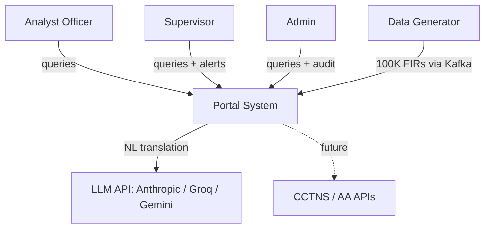
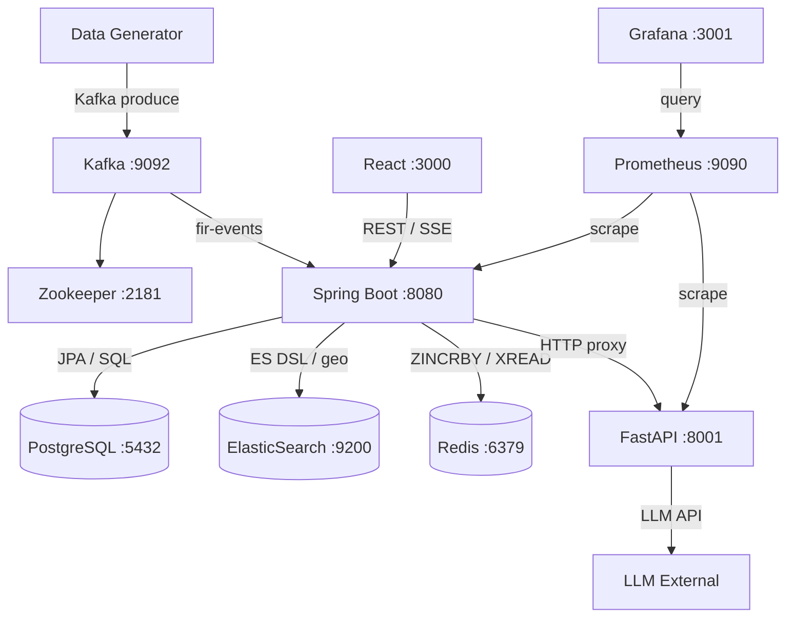
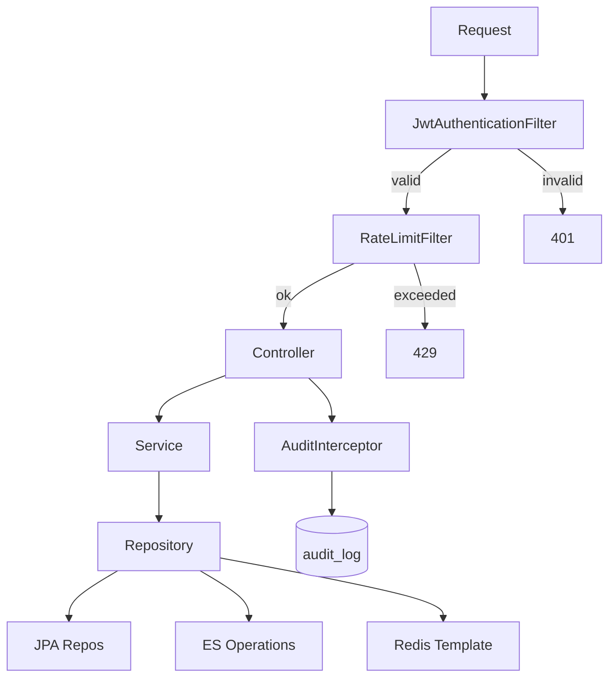
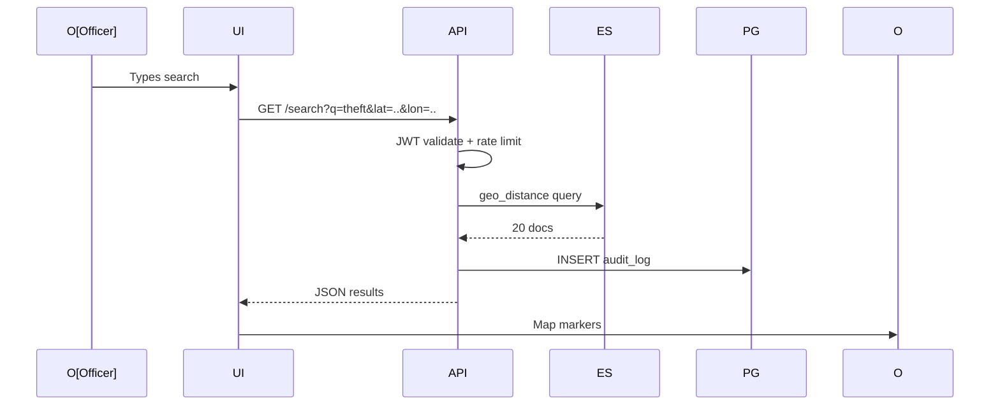
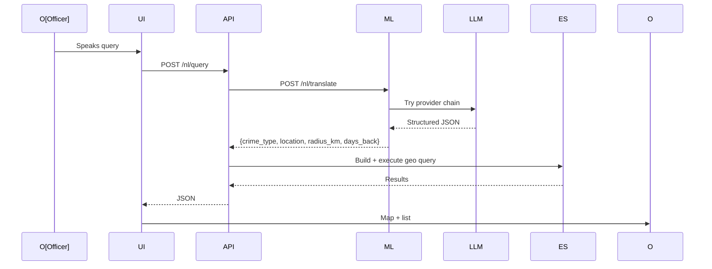
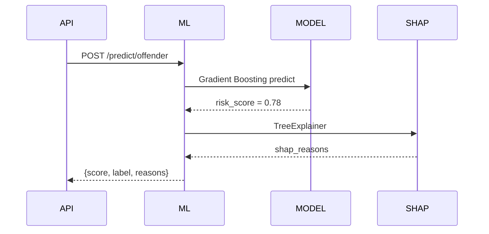

# Architecture — KSP Intelligence Portal

| | |
|---|---|
| **Version** | 1.0.0 |
| **Last Updated** | July 2026 |
| **Author** | Archishman Das |
| **Status** | Active |

---

## 2.2 System Context (C4 Level 1)



---

## 2.3 Container Diagram (C4 Level 2)



---

## 2.4 Component Diagram — Spring Boot API (C4 Level 3)



**Sample flow (GET /hotspots):** JWT validate → RateLimit check → `ZREVRANGE hotspots:live 0 9` → AuditInterceptor logs → JSON response.

---

## 2.5 Data Flow Diagrams

### Flow 1: Live FIR Event Pipeline

```mermaid
sequenceDiagram
    participant Gen as Generator
    participant K as Kafka
    participant C1 as Indexing
    participant C2 as Aggregation
    participant C3 as Anomaly
    Gen->>K: Produce FIR (key=district_code)
    par
        K->>C1: Consume
        C1->>PG: INSERT fir_records
        C1->>ES: INDEX crime-index
    and
        K->>C2: Consume
        C2->>RDS: ZINCRBY hotspots:live
        C2->>RDS: HINCRBY district:24h
        C2->>RDS: XADD alerts:stream
    and
        K->>C3: Consume
        C3->>C3: spike check (mean+2*sigma)
        C3->>ALT: Publish alert-event
    end
```

### Flow 2: Officer Geo Search



### Flow 3: Natural Language Query



### Flow 4: Offender Risk Scoring



---

## 2.6 Data Architecture

### PostgreSQL Schema

```sql
CREATE TABLE fir_records (
    fir_id VARCHAR(20) PRIMARY KEY,
    station_code VARCHAR(10) NOT NULL,
    district_code VARCHAR(5) NOT NULL,
    taluk_code VARCHAR(8) NOT NULL,
    crime_type VARCHAR(50) NOT NULL,
    latitude DECIMAL(10,7) NOT NULL,
    longitude DECIMAL(10,7) NOT NULL,
    incident_ts TIMESTAMPTZ NOT NULL,
    offender_id VARCHAR(20) REFERENCES offenders(offender_id),
    modus_operandi TEXT,
    status VARCHAR(20) DEFAULT 'OPEN'
) PARTITION BY RANGE (incident_ts);

CREATE TABLE offenders (
    offender_id VARCHAR(20) PRIMARY KEY,
    name_hash VARCHAR(64),
    age_group VARCHAR(20),
    prior_offenses INTEGER DEFAULT 0,
    modus_tags TEXT[],
    risk_score DECIMAL(5,2)
);

CREATE TABLE offender_network (
    offender_a VARCHAR(20) REFERENCES offenders,
    offender_b VARCHAR(20) REFERENCES offenders,
    shared_fir_id VARCHAR(20) REFERENCES fir_records,
    co_crime_count INTEGER DEFAULT 1,
    PRIMARY KEY (offender_a, offender_b, shared_fir_id)
);

CREATE TABLE audit_log (
    audit_id UUID DEFAULT gen_random_uuid() PRIMARY KEY,
    officer_id VARCHAR(20) NOT NULL,
    action_type VARCHAR(50) NOT NULL,
    query_text TEXT,
    endpoint_called VARCHAR(200),
    result_count INTEGER,
    ip_address INET,
    logged_at TIMESTAMPTZ DEFAULT NOW()
);
```

**Partitioning:** Monthly partitions on `incident_ts` keep time-range queries fast.
**Indexes:** `idx_fir_district(district_code, incident_ts DESC)`, `idx_fir_crime_type(crime_type, incident_ts DESC)`.
**Pooling:** HikariCP (max-pool-size: 20, min-idle: 5).
**Audit:** Append-only — no UPDATE/DELETE permissions.

### ElasticSearch Index

```json
{
  "mappings": {
    "properties": {
      "fir_id":       { "type": "keyword" },
      "district":     { "type": "keyword" },
      "crime_type":   { "type": "keyword" },
      "location":     { "type": "geo_point" },
      "incident_ts":  { "type": "date" },
      "modus_operandi": { "type": "text", "analyzer": "english" },
      "status":       { "type": "keyword" }
    }
  },
  "settings": { "number_of_shards": 3, "number_of_replicas": 0 }
}
```

**Query patterns:** `geo_distance`, `geo_bounding_box`, `match` (full-text), `range` (date).
**Why geo_point over PostGIS:** ES geo queries are inverted-index-based, integrate with full-text in a single query, and are faster for heatmap/search use cases.

### Redis Key Design

| Key | Type | TTL | Purpose |
|-----|------|-----|---------|
| `hotspots:live` | Sorted Set | — | Leaderboard; member=district, score=count |
| `district:24h:{code}` | Hash | 25h | Crime-type breakdown per district |
| `alerts:stream` | Stream | MAXLEN ~500 | SSE live feed |
| `ratelimit:{officer}` | String | 60s | Token bucket counter |
| `session:{jti}` | String | token expiry | JWT blocklist |
| `nl:cache:{hash}` | String | 1h | LLM translation cache |

**Why Sorted Set:** `ZINCRBY` O(log N), `ZREVRANGE` top-K O(K). Atomic, always current.
**Why Stream over Kafka for SSE:** In-memory, lower latency, aggregation consumer already writes there.

### Kafka

| Topic | Partitions | Key | Consumer Groups |
|-------|-----------|-----|-----------------|
| `fir-events` | 30 | `district_code` | indexing, aggregation, anomaly |
| `alert-events` | 3 | `district_code` | alert publisher |

**Offset:** Manual ack (`manual_immediate`) — at-least-once semantics.

---

## 2.7 Security Architecture

### JWT Lifecycle
1. **Issue:** Login → validate credentials → sign with `jwt.secret` → return token.
2. **Validate:** `JwtAuthenticationFilter` extracts Bearer token → validate → set SecurityContext.
3. **Refresh:** (planned) rotate tokens, blocklist old JTI in Redis.
4. **Logout:** (planned) add `session:{jti}` to Redis.

### RBAC

| Role | Permissions | Scope | Rate Limit |
|------|------------|-------|------------|
| ANALYST | Read: search, hotspots, trends, predictions, NL | District | 100 rpm |
| SUPERVISOR | All ANALYST + alerts + network | District | 200 rpm |
| ADMIN | All + audit access | State-wide | 500 rpm |

### Rate Limiting (Redis Token Bucket)
```
count = INCR("ratelimit:" + officerId)
if count == 1: EXPIRE(key, 60)
if count > limit: return 429
```

### LLM Injection Prevention
- System prompt hardcoded server-side; user text inserted only as `user_query` param.
- LLM output parsed as JSON, never eval'd.
- Spring Boot builds the ES query from structured params — LLM never generates raw DSL.
- Invalid JSON → regex fallback.

### Security Headers
| Header | Value |
|--------|-------|
| X-Content-Type-Options | nosniff |
| X-Frame-Options | DENY |
| X-XSS-Protection | 1; mode=block |
| Content-Security-Policy | default-src 'self' |
| Referrer-Policy | no-referrer |

### Data Privacy
- Offender names: SHA-256 hash, never plaintext.
- GPS: 4 decimal places (±11m), not exact address.
- Victim: only age_group + gender, no names.

---

## 2.8 LLM Integration Architecture

### System Prompt
```
You are a query translation assistant for a police crime database.
Return ONLY valid JSON: {crime_type, location, radius_km, days_back}.
If a field is not mentioned, return null.
Valid crime types: theft, robbery, murder, assault, cyber crime, drug offense.
Do NOT include explanation — only JSON.
```

### Why NOT RAG
RAG lets the LLM generate answers from retrieved documents — risk of hallucination in law enforcement. Instead, LLM only translates text → params; Spring Boot executes the real ES query. Data is deterministic, auditable, tamper-proof.

### Dynamic Provider Chain
```
LLM_PROVIDERS=anthropic,groq,gemini,fireworks,local
→ Try each in order → fallback to regex if all fail
```

### Cache
- Key: `nl:cache:{SHA256(query)}`, TTL: 1h.
- Cache hit → skip LLM call (saves cost + latency).

---

## 2.9 ML Architecture

### Hotspot Prediction (Random Forest)
- **Features:** day_of_week, month, district_code, prior_30d_count, crime_type_distribution
- **Output:** `{taluk, risk_level, confidence, top_features[]}`

### Offender Recidivism (Gradient Boosting)
- **Features:** prior_offenses, age_group, modus_tags, time_since_last_offense
- **SHAP:** TreeExplainer → `shap_reasons[]`
- **Output:** `{offender_id, recidivism_risk_score, risk_label, shap_reasons[]}`

### Model Serving
- Pre-loaded at FastAPI startup (`joblib.load`) — no cold start.
- Versioned `.pkl` files (`hotspot_rf_v1.pkl`, `offender_gb_v1.pkl`).

---

## 2.10 Observability

### Prometheus Metrics
| Metric | Source |
|--------|--------|
| `http_server_requests_seconds` | Spring Boot (Micrometer) |
| `http_server_requests_total` | Spring Boot |
| `jvm_memory_used_bytes` | Spring Boot |
| `http_request_duration_seconds` | FastAPI (Instrumentator) |

### Grafana Panels
1. API latency (p50, p95, p99)
2. Error rate (5xx)
3. Redis key-space size
4. Kafka consumer lag
5. ML service duration

### Health Checks
- Spring Boot Actuator `/actuator/health`
- Docker Compose healthcheck on every container
- FastAPI `/health`

---

## 2.11 ADRs

### ADR-001: Kafka partitioning by district_code (30 partitions)
**Context:** Three consumer groups need parallel consumption with per-district ordering.
**Decision:** 30 partitions keyed by `district_code`.
**Consequences:** Pro: ordering + parallelism. Con: hot districts may skew load.

### ADR-002: LLM as structured query translator (not RAG)
**Context:** Officers want NL queries; RAG risks hallucination.
**Decision:** LLM returns only JSON params; Spring Boot builds the query.
**Consequences:** Pro: no hallucination, auditable. Con: limited expressiveness.

### ADR-003: Redis Sorted Set for live leaderboard
**Context:** Need sub-ms live leaderboard updated on every event.
**Decision:** `ZINCRBY` + `ZREVRANGE` on `hotspots:live`.
**Consequences:** Pro: atomic, always current. Con: ephemeral (Redis restart loses data).

### ADR-004: scikit-learn over deep learning
**Context:** Tabular features; need interpretability.
**Decision:** RandomForest + GradientBoosting with SHAP.
**Consequences:** Pro: fast, interpretable, no GPU. Con: may miss complex non-linear patterns.

---

## 2.12 Known Limitations

| Limitation | Future |
|-----------|--------|
| Synthetic data (not CCTNS) | Integrate real CCTNS via AA APIs |
| 0 ES replicas | Production needs 1+ replica |
| No Kafka schema registry | Avro for type safety |
| Model accuracy limited | Real training data would improve |
| No mTLS | Docker network isolation for prototype |
| JWT refresh not implemented | Designed but not yet wired |
